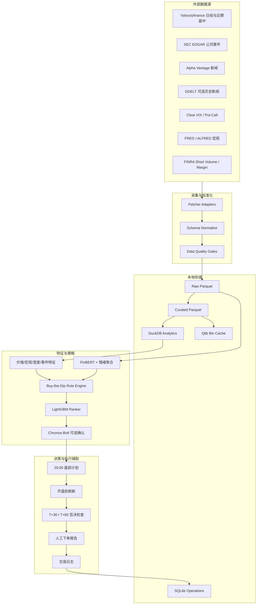

# Qlib 日频交易研究与决策系统重构实施计划

**Goal:** 将当前由若干实验脚本组成的 Qlib 项目重构为一个可重复、可回测、可每日运行、面向手动下单的日频 Buy-the-Dip 研究与决策辅助系统。

**Architecture:** 使用 Parquet 保存不可变历史数据，DuckDB 提供分析查询和训练集构建，SQLite 保存运行状态、信号、人工决策和持仓日志。规则引擎负责产生可解释的 Buy-the-Dip 候选，新闻与市场情绪负责风险过滤，LightGBM 只负责横截面排序；预训练模型只作为可替换的辅助特征或第二意见。

**Tech Stack:** Python 3.11+、pandas、PyArrow、DuckDB、SQLite、Pydantic、Typer、pytest、Qlib、LightGBM、yfinance、FinBERT、可选 Chronos-Bolt、结构化日志、macOS `launchd` 或 Codex Automations。

---

## 1. 执行摘要

当前项目已经具备若干有价值的原型：

- 基于 yfinance 的股票、宏观和行业 ETF 数据抓取。
- Qlib 数据转换与 Alpha158 扩展特征。
- LightGBM 多周期训练、OOF 级联、胜率校准。
- 日常 watchlist 技术扫描。
- 独立模拟和收益计算脚本。

但这些能力目前混在几个大脚本中，研究、回测、实时数据和交易展示之间的时间口径并不一致。重构的首要目标不是增加更多模型，而是建立以下约束：

1. 每条数据都有来源、发布时间、抓取时间和可用时间。
2. 每个信号都有明确的信号时间、最早下单时间、计划成交方式和退出方式。
3. 训练标签、回测成交和每日实际执行使用同一套时间定义。
4. 原始数据、特征、模型、预测和人工交易记录相互分离。
5. 任何模型都必须与简单规则基线比较，不能因为模型复杂就默认更有效。
6. 每日系统提供候选、价格区间、风险和取消条件，不自动下单。

推荐的最终策略形态是：

> 日线规则发现高质量回调，新闻和事件系统排除基本面破坏，市场与板块情绪决定风险预算，LightGBM 对候选排序，开盘后快照仅用于取消或缩减仓位，用户最终手动下单。

---

## 2. 目标与非目标

### 2.1 功能目标

- 管理一个明确、版本化的 AI 及相关产业 watchlist。
- 每日更新日线价格、宏观、板块、公司事件和新闻数据。
- 构建大盘、板块和个股三级情绪特征。
- 用完全可解释的规则生成 Buy-the-Dip 候选。
- 用 LightGBM 或预训练模型进行可选排序和风险确认。
- 在东京时间 20:00 前生成盘前交易计划。
- 在美股开盘前和开盘后 30/60 分钟生成增量风险检查。
- 生成适合人工下单的 HTML/CSV/Markdown 报告。
- 保存用户最终是否下单、实际成交价、仓位、退出和备注。
- 支持日线策略的无未来函数回测、walk-forward 验证和压力测试。
- 支持 forward paper trading，持续比较规则和模型的真实表现。

### 2.2 非目标

- 不建设高频或低延迟交易系统。
- 不依赖盘中持续盯盘。
- 不自动连接券商或自动下单。
- 不尝试预测每一根 1 分钟或 5 分钟 K 线。
- 不把新闻大模型的自然语言结论直接变成订单。
- 不在第一阶段引入云端微服务、Kafka、Kubernetes 等不必要复杂度。
- 不把当前热门 AI 公司事后选择结果当成无偏历史股票池。

### 2.3 非功能目标

- **可重复性：** 相同数据版本、配置和代码产生相同结果。
- **时间正确性：** 历史回测只能使用决策时间之前已知的数据。
- **可靠性：** 单个数据源失败时保留上次成功数据，但明确标记 stale。
- **可观察性：** 每次运行输出结构化日志、数据质量报告和失败原因。
- **性能：** 100–2,000 个日线股票的每日更新应在普通 Mac 上完成。
- **成本：** 第一阶段以免费数据源和本地运行优先。
- **安全性：** API Key 使用环境变量或 1Password，不写入源码。
- **恢复能力：** 原始 Parquet 可重新构建 DuckDB、Qlib bin 和全部特征。

---

## 3. 当前项目的主要问题

### 3.1 研究口径问题

- 训练标签以次日价格为起点，手工回测以当日收盘为起点，策略定义不一致。
- Top 10 中只要一只股票达到胜率阈值，当前逻辑可能把全部股票标记为成交。
- 手工组合报告忽略持仓重叠、资金占用、滑点和交易成本。
- 未成熟的 T+N 收益有时会用最新价格代替，导致胜率被污染。
- 当前 Wikipedia 成分股被用于过去历史，存在幸存者偏差。
- 基本面使用固定 45 天延迟，不能替代真实公告时间。

### 3.2 数据工程问题

- 每只股票一个 CSV，当前已有多种 schema。
- 数据转换字段取决于目录中的第一个 CSV，结果不确定。
- 数据下载失败会沿用旧缓存，但主流程不会因 stale 数据停止。
- 线程池内又用全局下载锁，实际并发收益有限。
- Qlib bin 同时承担原始数据和运行数据的角色，不利于重建。
- 新闻、事件、情绪和人工交易记录尚无统一存储。

### 3.3 软件工程问题

- `src/main.py` 同时负责下载、转换、训练、校准、回测、实时期权和展示。
- `daily_scan.py` 与 `simulate.py` 共享逻辑但缺少清晰领域模块。
- 多处裸 `except` 和全局忽略 warning，失败难以诊断。
- 当前 `test_*.py` 是手工实验脚本，没有真正 pytest 测试。
- 没有项目元数据、锁定依赖、README、`.gitignore` 和数据契约。
- 定时脚本即使 Python 失败也可能打印成功。
- 仓库当前不是 Git 仓库，无法安全执行分阶段重构和回滚。

---

## 4. 关键设计决策

### ADR-001：使用模块化单体，而不是微服务

**决定：** 所有能力保留在一个 Python 项目中，以清晰模块和 CLI 子命令隔离。

**原因：**

- 只有一个用户和一台主要运行机器。
- 数据量远未达到分布式系统需求。
- 本地调试、备份和失败恢复比水平扩展重要。

**后果：**

- 简化部署和运维。
- 模块边界必须通过接口、schema 和测试维持。

### ADR-002：Parquet 为事实数据，DuckDB 为分析层

**决定：**

- 原始和整理后的时间序列保存为 Parquet。
- DuckDB 直接读取 Parquet 或缓存高频查询表。
- CSV 仅用于人工导出。

**原因：**

- Parquet 列式压缩、schema 明确、适合价格和特征矩阵。
- DuckDB 可直接查询 Parquet，并支持过滤和列投影。
- 能消除 1,500 多个零散 CSV 带来的 schema 漂移。

**参考：**

- [DuckDB Parquet](https://duckdb.org/docs/stable/data/parquet/overview)

### ADR-003：SQLite 保存操作性状态

**决定：** 使用 SQLite 保存运行记录、信号、人工审批、模拟订单、实际成交和持仓。

**原因：**

- 这些数据需要事务和频繁单行更新。
- 数据量小，单用户写入。
- 与大量追加型行情数据的存储模式不同。

### ADR-004：规则是策略主体，模型是排序器

**决定：**

- Buy-the-Dip 的市场环境、趋势、回撤、事件和入场条件由规则定义。
- LightGBM 预测未来 5/10 日相对 QQQ 或行业 ETF 的超额收益排名。
- 模型不能绕过硬风险规则。

**原因：**

- 更容易回测、解释和手动执行。
- 降低个人交易者面对样本噪声时的过拟合风险。
- 模型失效时系统仍可运行。

### ADR-005：实时快照只是否决器

**决定：** 开盘后 30/60 分钟数据只用于取消、降低仓位或延后交易，不用于凭空产生新候选。

**原因：**

- 历史分钟数据不足时仍能严肃验证日线主体。
- 避免把无法回测的盘中直觉变成主要 alpha。
- 适合手动下单。

### ADR-006：新闻保存原文元数据并固定模型版本

**决定：**

- 保存标题、摘要、发布时间、抓取时间、URL、来源和 ticker relevance。
- 使用固定版本 FinBERT 重算情绪。
- 第三方自带 sentiment 仅作辅助字段。

**原因：**

- 第三方评分算法可能改变。
- 历史回测必须明确当时是否已经发布。
- 同一新闻被转载时必须可去重。

### ADR-007：Qlib bin 是可重建产物

**决定：** Qlib bin 从 curated Parquet 生成，不再视为原始事实数据。

**原因：**

- 可以随 schema 和 Qlib 版本重建。
- 更容易验证 Qlib 输入与研究数据一致。

### ADR-008：每个阶段必须保留可运行的端到端主路径

**决定：**

- 每个 Phase 完成时必须能从本地数据执行一条最小可用路径。
- 任何新组件不能让既有主路径失效；ML、新闻、Chronos 等模块必须可关闭。
- 阶段验收优先 smoke test 和数据契约测试，再增加功能覆盖。

**原因：**

- 该系统包含多个数据源、模型和运行时，最大风险不是单点技术失败，而是范围蔓延后“代码很多但整体跑不通”。
- 个人交易系统的第一价值是每天稳定给出可解释候选，而不是一次性堆满所有数据源。

**端到端 smoke 最小路径：**

```text
价格数据 → Raw Parquet → DuckDB → 技术特征 → 规则扫描 → 候选/空候选 JSON
```

Phase 0/1 之后即使没有 ML、新闻和情绪，也必须能用 5 个核心标的跑通这个路径。后续每个 Phase 都要在同一条路径上增加一个可关闭的能力。

### ADR-009：外部数据源必须有版本锁、预算和可替换 adapter

**决定：**

- yfinance 只作为价格 adapter 的一个实现，不能成为无法替换的隐式依赖。
- 依赖版本必须由锁文件固定；升级 yfinance、Alpha Vantage 或 SEC adapter 行为时必须更新 `source_version`，并跑已知日期 golden test。
- 新闻和 SEC 采集必须声明 rate limit、daily call budget、retry/backoff 和 fallback 行为。
- 价格采集失败时优先保留本地 Raw Parquet last-known-good facts，并通过 stale/core-symbol gate 决定 `DEGRADED` 或 `BLOCKED`。
- 引入 EODHD、Financial Modeling Prep、Polygon.io 或 Interactive Brokers 等备用价格源时，只能新增 provider-neutral adapter，不得绕过 raw schema 或 DuckDB 视图。

**原因：**

- yfinance 是非官方数据接口，可能受 Yahoo 前端和限流变化影响。
- Alpha Vantage 免费和付费账户都有调用频率与总量约束。
- 数据源失败不应污染 raw 事实层，也不应静默生成交易建议。

### ADR-010：日线回测采用悲观撮合假设

**决定：**

- 只有日线 OHLC 时，所有无法确认的盘中路径都采用对策略更不利的解释。
- 若开盘价跳空越过止损，按 open 价成交，而不是按 stop 价假设完美止损。
- 同一天同时触发止损和止盈时，默认止损先发生。
- T+30/T+60 快照门禁在纯日线回测中不能精确还原；回测中只允许保守降级，例如将“盘中取消”视为当日不成交，不能用未来分钟走势优化入场。

**原因：**

- 日线 OHLC 不包含真实成交路径、队列、盘口和 T+30/T+60 的当时状态。
- 手动交易系统宁可低估策略收益，也不能把不可验证的盘中判断包装成历史 alpha。

---

## 5. 目标总体架构



---

## 6. 重构后的目录结构

```text
qlib_local/
├── README.md
├── AGENTS.md
├── pyproject.toml
├── uv.lock
├── .env.example
├── .gitignore
├── configs/
│   ├── app.yaml
│   ├── universe/
│   │   ├── ai_watchlist.yaml
│   │   └── sector_map.yaml
│   ├── strategy/
│   │   ├── buy_the_dip.yaml
│   │   └── risk.yaml
│   ├── models/
│   │   ├── lightgbm.yaml
│   │   ├── finbert.yaml
│   │   └── chronos.yaml
│   └── sources/
│       ├── prices.yaml
│       ├── news.yaml
│       └── macro.yaml
├── docs/
│   ├── architecture.md
│   ├── data-contracts.md
│   ├── daily-runbook.md
│   ├── strategy-spec.md
│   └── plans/
│       └── 2026-06-28-quant-repo-refactor.md
├── src/
│   └── quant_system/
│       ├── __init__.py
│       ├── cli.py
│       ├── settings.py
│       ├── logging.py
│       ├── domain/
│       │   ├── models.py
│       │   ├── enums.py
│       │   └── clocks.py
│       ├── ingestion/
│       │   ├── prices.py
│       │   ├── intraday.py
│       │   ├── sec.py
│       │   ├── news.py
│       │   ├── macro.py
│       │   └── finra.py
│       ├── storage/
│       │   ├── parquet.py
│       │   ├── duckdb.py
│       │   ├── sqlite.py
│       │   └── schemas.py
│       ├── quality/
│       │   ├── checks.py
│       │   └── reports.py
│       ├── features/
│       │   ├── technical.py
│       │   ├── market.py
│       │   ├── sector.py
│       │   ├── fundamentals.py
│       │   ├── events.py
│       │   └── sentiment.py
│       ├── sentiment/
│       │   ├── finbert.py
│       │   ├── entity_linking.py
│       │   ├── deduplication.py
│       │   └── aggregation.py
│       ├── strategy/
│       │   ├── buy_the_dip.py
│       │   ├── market_regime.py
│       │   ├── entry_rules.py
│       │   ├── exit_rules.py
│       │   └── position_sizing.py
│       ├── models/
│       │   ├── datasets.py
│       │   ├── lightgbm_ranker.py
│       │   ├── calibration.py
│       │   ├── chronos.py
│       │   └── registry.py
│       ├── backtest/
│       │   ├── engine.py
│       │   ├── execution.py
│       │   ├── portfolio.py
│       │   ├── metrics.py
│       │   └── walk_forward.py
│       ├── decision/
│       │   ├── premarket.py
│       │   ├── open_gate.py
│       │   ├── reports.py
│       │   └── journal.py
│       └── qlib_adapter/
│           ├── exporter.py
│           ├── handler.py
│           └── workflow.py
├── tests/
│   ├── unit/
│   ├── integration/
│   ├── fixtures/
│   └── golden/
├── scripts/
│   ├── migrate_csv_to_parquet.py
│   ├── bootstrap_duckdb.py
│   └── install_launchd.sh
└── data/
    ├── raw/
    │   ├── prices/year=YYYY/month=MM/*.parquet
    │   ├── intraday_5m/year=YYYY/month=MM/*.parquet
    │   ├── news/year=YYYY/month=MM/*.parquet
    │   ├── company_events/year=YYYY/month=MM/*.parquet
    │   ├── macro/*.parquet
    │   └── sentiment_indices/*.parquet
    ├── curated/
    │   ├── daily_features/year=YYYY/*.parquet
    │   ├── sentiment/year=YYYY/*.parquet
    │   └── labels/year=YYYY/*.parquet
    ├── db/
    │   ├── analytics.duckdb
    │   └── operations.sqlite
    ├── qlib/
    ├── models/
    ├── reports/
    └── quarantine/
```

---

## 7. 数据分层与数据契约

### 7.1 Raw 层

Raw 层只做最少标准化，不覆盖历史文件。

公共字段：

| 字段 | 含义 |
|---|---|
| `source` | 数据源名称 |
| `source_version` | API 或采集器版本 |
| `fetched_at_utc` | 实际抓取时间 |
| `available_at_utc` | 策略最早可使用时间 |
| `ingestion_run_id` | 本次运行 ID |
| `is_stale` | 是否沿用旧值 |
| `quality_flags` | 数据质量标志 |

价格字段：

```text
symbol, timestamp_utc, session_date_ny,
open, high, low, close, volume,
adjusted, split_factor, dividend
```

新闻字段：

```text
article_id, published_at_utc,
title, summary, url, source_domain,
canonical_url, dedupe_key, semantic_key,
language, raw_tickers, raw_topics, matched_symbols,
event_type, severity, sentiment_label, sentiment_score
```

SEC 事件字段：

```text
event_id, cik, symbol, form_type, accession_number,
filed_at_utc, accepted_at_utc, filing_url,
event_type, severity
```

### 7.2 Curated 层

Curated 层保证 schema、主键、时区和缺失值规则稳定。

关键表：

- `daily_prices`
- `intraday_bars_5m`
- `company_fundamentals_pit`
- `company_events`
- `news_articles`
- `article_ticker_links`
- `article_sentiment`
- `market_sentiment_daily`
- `sector_sentiment_daily`
- `ticker_sentiment_daily`
- `daily_features`
- `strategy_labels`

### 7.3 Operations SQLite

核心表：

```text
pipeline_runs
data_source_status
candidate_signals
trade_plans
manual_decisions
orders_manual
fills_manual
positions
exits
model_registry
config_versions
```

人工记录必须区分：

- 系统建议。
- 用户决定。
- 实际委托。
- 实际成交。
- 实际退出。

否则无法评估策略问题、执行问题和人工覆盖问题分别贡献了多少收益。

### 7.4 存储边界决策矩阵

任何新模块写数据前必须先选择唯一系统 of record。禁止因为查询方便把事实数据写进 DuckDB，也禁止把运行状态写进 Parquet。

| 数据类型 | 写入位置 | 负责写入模块 | 只读消费者 | 禁止事项 |
|---|---|---|---|---|
| Raw 价格、新闻、SEC、宏观事实 | `data/raw/**/*.parquet` | `ingestion/*`、migration | DuckDB、quality、features、strategy | 不更新、不覆盖、不手工修 Parquet |
| Curated 特征、标签、情绪日聚合 | `data/curated/**/*.parquet` | `features/*`、`models/datasets.py` | backtest、ranker、reports | 不作为人工交易日志 |
| DuckDB views/cache | `data/db/analytics.duckdb` | `storage/duckdb.py` rebuild | research、scan、backtest、reports | 不作为系统 of record |
| Qlib bin cache | `data/qlib/` | `qlib_adapter/exporter.py` | Qlib workflow | 不手工编辑；可删除重建 |
| pipeline runs、人工决策、订单、成交、持仓 | `data/db/operations.sqlite` | `decision/*`、`journal/*` | reports、weekly review | 不写入 Parquet raw |
| backtest summary、trades、equity、stress grid | `data/reports/backtests/<run_id>/` | `backtest/reports.py` | human、model comparison | 不混入 SQLite 交易事实 |
| walk-forward fold metrics、OOF predictions | `data/reports/models/<run_id>/`；晋级后登记 SQLite registry | `models/*` | model registry、reports | 不覆盖 raw/curated 输入 |
| runtime logs、quality reports | `data/reports/quality/`、logs | pipeline/quality modules | human、automation | 不作为策略输入，除非显式 curated |

### 7.5 数据源版本锁与 golden checks

- `pyproject.toml` 可以声明兼容范围，但实际生产运行必须以锁文件中的解析版本为准。
- yfinance adapter 每次升级依赖或变更 `auto_adjust/actions/repair` 等关键参数，都必须更新 adapter `source_version`。
- 集成测试应保存少量已知日期 OHLCV fixture，验证 close、volume、split/dividend 处理和 schema 不漂移。
- 长期可引入 Polygon.io、Interactive Brokers 或其他商业价格 API 作为 primary/fallback；但新增 provider 必须先实现同一 provider-neutral contract。
- 没有备用价格源时，fallback 只能是本地 Raw Parquet 的 last-known-good facts；若核心标的超过 stale 阈值，交易建议必须 `BLOCKED`。
- 若 Yahoo 返回 HTTP 429/403 或空响应，adapter 不得扩大并发重试；必须经过 rate limiter、exponential backoff 和 daily call budget gate。

---

## 8. 股票池设计

### 8.1 Live watchlist

用于每天实际扫描，可包含 30–100 个高流动性 AI 产业链股票：

- AI 芯片与设计。
- 半导体设备。
- 数据中心、电力和散热。
- 云平台与基础模型。
- 网络与光通信。
- AI 软件与应用。

每个股票必须有：

```text
symbol
company_name
sector
theme
start_date
end_date
reason
liquidity_tier
benchmark_etf
```

### 8.2 Backtest universe

不能直接用今天的热门名单回测过去。

允许三种方法：

1. 使用 point-in-time 指数成分。
2. 使用稳定、规则化、可历史重建的流动性股票池。
3. 对当前 watchlist 只做从明确起始日期之后的 forward test。

报告必须标记 universe 类型，禁止把 forward-only 结果与无偏历史回测混合。

---

## 9. Buy-the-Dip 策略规范

### 9.1 策略假设

> 在大盘和行业长期趋势未被破坏、公司没有重大负面事件时，具有长期相对强度的高流动性股票发生中等幅度短期回调后，等待价格确认再进入，未来 5–10 个交易日具有正超额收益机会。

### 9.2 市场环境硬过滤

第一版使用简单规则：

- `QQQ > MA200`。
- QQQ 的 `MA50` 不显著向下。
- VIX 不处于异常上升状态，或异常状态下自动降低风险预算。
- 市场宽度未出现全面恶化。
- 高收益债利差未快速扩大。

市场环境输出：

```text
GREEN: 正常风险预算
YELLOW: 半仓或更严格候选
RED: 不开新仓
```

### 9.3 股票质量与趋势过滤

- 20 日平均成交额超过配置阈值。
- `Close > MA200`。
- `MA50` 斜率为正或接近水平。
- 60 日相对 QQQ/行业 ETF 收益为正。
- 不在财报前配置的禁入窗口内。
- 无重大监管、欺诈、持续经营或公司级事故。

### 9.4 Dip 条件

建议测试而非固定单点：

- 距 20 日高点回撤在 5%–15%。
- RSI14 在 30–45。
- Close 低于 MA20，但仍高于 MA200。
- 回撤幅度为 1–3 ATR。
- 成交量可表现为恐慌放量或缩量回调，两者分别建子策略。

### 9.5 入场规则

主规则使用日线确认：

```text
昨日满足 Dip
今日收盘重新站上 MA5
或今日收盘高于昨日最高价
→ 下一交易日才允许入场
```

可选限价版本：

```text
limit = previous_close - 0.3 * ATR20
```

但必须配置：

- 极端低开取消。
- 大幅高开不追。
- 订单只保留一个交易日。

### 9.6 开盘后快照否决规则

在 T+30 或 T+60 获取：

- 当日 Open。
- 当前价格。
- Day High/Low。
- 当前成交量。
- QQQ 和行业 ETF 当前价格。
- 增量新闻和 SEC 事件。

第一版只使用以下透明规则：

- QQQ 当前价不低于开盘价过多。
- 股票当前价高于开盘价。
- 股票位于当日价格区间上半部。
- 未超过计划中的最高可接受买入价。
- 没有新增严重负面事件。
- 没有扩大为超过配置 ATR 的异常下跌。

快照只允许：

- `KEEP`
- `REDUCE`
- `DEFER`
- `CANCEL`

不允许从非候选生成 `BUY`。

纯日线回测不能真实模拟 T+30/T+60。若 Phase 6 引入开盘后门禁，历史回测必须选择以下之一：

- 有可靠分钟级数据时，按真实 `asof` cutoff 重放。
- 没有分钟级数据时，门禁逻辑从日线回测中关闭，只在 forward paper trading 中评估。
- 若必须保守近似，则把触发取消的订单视为当日未成交，不允许用当日 high/low 的事后路径来优化 `KEEP/CANCEL`。

### 9.7 仓位与退出

第一版：

- 单笔计划亏损不超过账户净值的 0.25%–0.50%。
- 初始止损以 ATR 或结构低点计算。
- 最低预期收益风险比由配置控制。
- T+5/T+10 时间退出。
- 可选分批止盈和移动止损必须独立回测。

仓位公式：

```text
position_size = risk_budget / abs(entry_price - stop_price)
```

组合层约束优先级高于单票公式：

- 默认保留现金缓冲，例如 40% reserve cash。
- 总持仓市值不得超过配置的 gross exposure 上限。
- 单票市值不得超过配置的 max position fraction。
- 多个候选同时触发时，先按规则分数和后续模型排名排序，再在现金和风险预算内截断。
- 若可用现金不足以维持 reserve cash，系统只能给出 `WATCH` 或 `SKIP_CASH_LIMIT`，不得假设未来卖出或盘中退出释放资金。
- 回测执行器不能用同日盘中或收盘卖出所得去资助同日开盘买入。

---

## 10. 新闻与情绪系统

### 10.1 数据源优先级

第一阶段：

1. Alpha Vantage News & Sentiment：快速获得历史和实时 ticker 关联新闻。
2. SEC EDGAR：重大公司事件和真实公告时间。
3. 公司 Investor Relations RSS/网页：一手新闻稿。
4. Yahoo/yfinance news：仅作补充。

第一阶段必须在 `configs/sources/news.yaml` 中声明：

```yaml
alpha_vantage:
  calls_per_minute: 5
  daily_call_budget: 25
  batch_size: 10
  limit_per_call: 50
sec:
  calls_per_second: 5
  daily_call_budget: 200
```

免费额度下不允许按 100 个 ticker 逐只、多次拉取新闻。默认应按小批量 ticker 和时间窗口合并请求；超出 daily budget 时返回 `DEGRADED` 或 `BLOCKED`，不得用无限 `sleep` 掩盖预算不足。若暂时没有第二新闻源，fallback 策略必须明确写成“无可用 fallback，只保留已抓取事实并降级运行”。

第二阶段：

5. GDELT：扩展历史新闻和全球事件覆盖。

参考：

- [Alpha Vantage News Sentiment](https://www.alphavantage.co/documentation/)
- [SEC EDGAR API](https://www.sec.gov/edgar/sec-api-documentation)
- [GDELT DOC API](https://blog.gdeltproject.org/gdelt-doc-2-0-api-debuts/)

### 10.2 新闻处理流程


FinBERT 基础分数：

```text
sentiment_score = P(positive) - P(negative)
```

聚合特征：

- `sentiment_weighted_mean`
- `sentiment_min`
- `negative_article_count`
- `high_severity_negative_count`
- `news_count`
- `news_count_zscore_60d`
- `sentiment_change_1d`
- `sentiment_change_5d`
- `earnings_sentiment`
- `regulatory_sentiment`
- `management_sentiment`

### 10.3 事件分类优先于普通情绪

以下事件应单独分类，不能只看 positive/negative：

- 财报和 guidance。
- 并购。
- 新产品和客户合同。
- 监管调查。
- 诉讼。
- 高管离职。
- 股票发行和可转债。
- 回购。
- 内部人买卖。
- 数据泄露和安全事故。

### 10.4 大盘情绪

直接保存或构建：

- VIX、VIX9D、VVIX。
- Equity/Index Put-Call Ratio。
- 高收益债利差。
- FINRA 融资余额月度变化。
- 上涨股票比例。
- 站上 MA20/50/200 的股票比例。
- 新高/新低比。
- SPY/QQQ 动量。
- 防御行业相对强度。

参考：

- [Cboe VIX Historical Data](https://www.cboe.com/tradable_products/vix/vix_historical_data)
- [Cboe Put/Call Historical Data](https://www.cboe.com/us/options/market_statistics/historical_data/)
- [FINRA Margin Statistics](https://www.finra.org/rules-guidance/key-topics/margin-accounts/margin-statistics)

### 10.5 板块情绪

板块情绪由系统构建，不依赖黑盒指数：

- 行业 ETF 相对 SPY 强度。
- 行业 ETF 波动率和回撤。
- 成分股上涨比例。
- 成分股站上 MA20/50/200 的比例。
- 成分股新闻情绪加权平均。
- 板块新闻热度 Z-score。
- 板块内部强弱分化。

### 10.6 个股情绪

个股情绪由以下特征组成：

- 新闻情绪与尾部负面事件。
- 新闻热度异常。
- SEC 事件。
- Form 4 内部人交易。
- FINRA short-volume 变化。
- 分析师评级变化，数据可用时加入。
- 个股期权情绪仅在可靠历史数据可得时加入。

---

## 11. 模型体系

### 11.1 规则基线

所有模型必须击败以下基线：

1. QQQ 买入持有。
2. AI watchlist 等权持有。
3. 无模型 Buy-the-Dip。
4. 线性或 Ridge 排序。
5. LightGBM 排序。
6. 规则 + 新闻过滤 + LightGBM。

### 11.2 LightGBM 的职责

预测目标：

```text
未来 5/10 日股票收益 - 同期 QQQ 或行业 ETF 收益
```

使用方式：

- 对已经通过硬过滤的候选排序。
- 输出排名、预测分数和不确定性代理。
- 不将原始分数解释为真实胜率，除非经过严格 OOF 校准。

初始复杂度应比当前配置更保守：

- 较浅树。
- 更少 leaves。
- 较大 `min_data_in_leaf`。
- 更强 L1/L2。
- 受控特征数量。

### 11.3 FinBERT 的职责

- 新闻情绪分类。
- 不直接预测价格。
- 固定模型版本和 tokenizer。
- 保存模型 ID、哈希和推理时间。
- 默认 scorer 可以是 deterministic rule-based fallback；FinBERT 不得成为每日流程硬依赖。
- FinBERT 必须 lazy loading，第一次真实推理时才加载模型权重。
- 本地推理配置必须声明 `device: auto|cpu|mps`、`batch_size`、`max_articles_per_run`。
- CPU/MPS 推理耗时必须进入运行报告；超过预算时降级为 rule-based 或 sentiment unavailable。
- FinBERT 推理结果必须以 `article_id` 或 `dedupe_key` 为粒度强缓存；相同模型版本、tokenizer 版本和 article key 下不得重复推理。
- 缓存记录必须包含 `model_id`、`model_revision`、`scored_at_utc`、`input_hash`、`sentiment_label` 和 `sentiment_score`。
- 开盘前 10 分钟刷新必须有超时熔断；超时后报告写入 `sentiment_status: DEGRADED`，并自动使用关键词/事件规则，不阻塞价格和硬规则扫描。

参考：

- [ProsusAI FinBERT](https://huggingface.co/ProsusAI/finbert)

### 11.4 Chronos-Bolt 的职责

可选实验：

- 使用近期日收益率预测未来 5 日分布。
- 使用最近数日 5 分钟收益率，对当天未来 30–60 分钟提供第二意见。
- 不需要本地训练，但需要近期上下文序列。

约束：

- 只作为 `KEEP/CANCEL` 的辅助特征。
- 必须与无模型版本做 forward A/B。
- 若模型训练截止日期不明确，不用于重叠历史时期的可信回测。

参考：

- [Amazon Chronos](https://github.com/amazon-science/chronos-forecasting)

### 11.5 模型注册

每个模型记录：

```text
model_id
model_type
trained_at
train_range
valid_range
test_range
universe_version
feature_set_version
label_definition
config_hash
code_version
artifact_path
metrics
status
```

---

## 12. 回测设计

### 12.1 统一时间定义

每个策略必须声明：

```text
signal_time
data_cutoff
earliest_order_time
entry_rule
exit_rule
price_adjustment
commission
slippage
```

推荐主策略：

```text
T 日收盘后生成确认信号
T+1 日开盘后才允许成交
持有 5 或 10 个完整交易日
```

### 12.2 日线限价成交

若只有日线 OHLC：

- 当日 Low 未触及限价则不成交。
- 若开盘价低于限价，使用更保守的开盘价或配置的 gap 规则。
- 同一天同时触发止损和止盈时，默认止损先发生。
- 未来数据不足时 Return_T+N 为 `NaN`，不得使用最新价格替代。

### 12.3 Walk-forward

示例：

```text
Train: 3 年
Valid: 6 个月
Test: 6 个月
每 3 或 6 个月滚动
```

训练与验证之间必须设置 embargo，避免标签和特征窗口重叠。Embargo 不只覆盖最大持有期，还要覆盖最大特征 lookback：

```text
last_train_label_end <= first_validation_date - (hold_period + feature_lookback_days)
```

`backtest/walk_forward.py` 必须包含断言或测试，遍历每个 fold 确认：

- 任意训练样本的 label end 不晚于验证集最早日期之前的 embargo cutoff。
- 任意验证样本的 feature window 不读取验证 cutoff 之后的数据。
- 若某个 fold 样本不足，返回明确的 `INSUFFICIENT_SAMPLE`，不得自动缩短 embargo。

### 12.4 压力测试

- 交易成本 1x、1.5x、2x。
- 入场价恶化 0、5、10、20 bps。
- 止损和目标参数 ±20%。
- RSI、回撤和趋势阈值附近参数网格。
- 牛市、熊市、高波动、低波动分组。
- 大盘、板块和个股级收益归因。
- 排除表现最好的年份或股票，观察策略是否仍成立。

### 12.5 核心指标

- CAGR。
- 最大回撤。
- Sharpe/Sortino。
- 胜率和盈亏比。
- 每笔期望收益。
- 暴露时间。
- 换手率。
- 相对 QQQ alpha。
- 年度和市场状态分组表现。
- 候选数、成交率和被风险过滤比例。

---

## 13. 每日用户流程

美国夏令时和冬令时会使美股开盘对应东京时间变化。程序必须使用 `America/New_York` 和 `Asia/Tokyo` 时区计算，不能硬编码。

美股正常开盘始终按纽约时间 09:30 计算：

- 美国夏令时期间，纽约为 EDT，通常对应东京时间 22:30。
- 美国冬令时期间，纽约为 EST，通常对应东京时间 23:30。
- 美国夏令时切换周前后，日本日期不变但 UTC offset 会变，所有调度必须由 IANA timezone 和交易日历计算，不得写死月份、周数或 JST 时间。
- `premarket`、`open-30`、`open-60` job 必须在运行时输出本次使用的 NY time、JST time 和 UTC time，便于人工发现调度错位。

### 13.1 美股收盘后自动更新

建议时间：东京清晨，美股收盘完成后。

自动步骤：

1. 更新上一交易日日线价格。
2. 更新宏观、VIX、Put-Call 和市场宽度。
3. 更新 SEC、新闻和公司事件。
4. 运行数据质量检查。
5. 更新 curated Parquet 和 DuckDB。
6. 计算日线技术、市场、板块和情绪特征。
7. 更新 forward paper positions 的收益和状态。

用户不需要参与，除非收到数据失败通知。

### 13.2 东京时间 20:00 前：盘前计划

自动步骤：

1. 增量抓取从上次 cutoff 之后的新闻和 SEC 事件。
2. 运行 FinBERT、实体映射和情绪聚合。
3. 判断大盘风险状态。
4. 运行 Buy-the-Dip 硬规则。
5. LightGBM 对通过规则的候选排序。
6. 生成计划入场区间、止损、目标价和仓位。
7. 输出 HTML 和 CSV。

用户需要：

- 阅读候选及重大新闻摘要。
- 标记 `approve / reject / watch`。
- 必要时写下人工否决原因。

报告示例：

| Ticker | Rank | Setup | News Risk | Entry Range | Max Buy | Stop | Size | Decision |
|---|---:|---|---|---:|---:|---:|---:|---|
| NVDA | 1 | Dip Confirmed | Low | 120–122 | 122 | 116 | 20 | Watch |

### 13.3 美股开盘前 10 分钟：风险刷新

自动步骤：

1. 增量新闻。
2. 盘前价格和成交量。
3. QQQ、行业 ETF 和候选股票 gap。
4. 检查财报、评级、SEC 和公司新闻。
5. 更新 `KEEP/REDUCE/CANCEL`。

用户需要：

- 查看是否出现新的取消原因。
- 不在盘前低流动性时追价。

### 13.4 开盘后 30 分钟：第一检查点

自动步骤：

1. 获取 Open、当前价、Day High/Low、成交量。
2. 获取 QQQ 和行业 ETF 同类快照。
3. 检查候选是否高于开盘、位于日内区间上半部。
4. 检查是否超过 Max Buy。
5. 检查新增新闻。
6. 输出 `KEEP/REDUCE/DEFER/CANCEL`。

用户需要：

- 只对 `KEEP` 候选考虑小仓位。
- 手动输入实际订单。

### 13.5 开盘后 60 分钟：第二检查点

自动步骤：

1. 更新同样快照。
2. 判断是否继续创新低。
3. 判断 QQQ/行业是否企稳。
4. 可选运行 Chronos-Bolt 短期确认。
5. 给出最终计划状态。

用户需要：

- 决定是否下单、加仓或取消。
- 记录真实成交价。
- 同时设置止损/OCO，若券商支持人工条件单。

### 13.6 收盘后交易日志

用户需要补充：

- 是否成交。
- 成交价和数量。
- 止损与目标。
- 人工覆盖系统的原因。
- 交易情绪或执行错误。

系统自动：

- 更新持仓。
- 计算计划价格与真实成交的滑点。
- 区分策略收益和执行收益。

---

## 14. Codex 可以自动化什么

### 14.1 可完全自动化

- 数据下载和增量更新。
- Parquet 分区、DuckDB 刷新和 Qlib 导出。
- 数据质量检查。
- 技术、宏观、市场宽度和情绪特征。
- 新闻去重、FinBERT 分类和事件摘要。
- Buy-the-Dip 候选生成。
- LightGBM 训练、walk-forward 和报告。
- 盘前、开盘前、T+30、T+60 报告。
- 邮件、文件或聊天通知，接入对应连接器后。
- 每日运行状态检查和失败重试。
- 周度/月度绩效分析。
- forward paper trading。

### 14.2 需要人工参与

- 判断无法结构化的重大新闻。
- 最终决定是否交易。
- 手动向券商提交订单。
- 确认实际成交和部分成交。
- 处理停牌、异常波动和券商限制。
- 调整账户风险预算。

### 14.3 Codex 的角色

Codex 可以：

- 实现和维护所有脚本。
- 定时唤醒线程执行每日流程。
- 读取输出并生成摘要。
- 在数据质量失败时诊断和修复代码。
- 每周分析策略是否偏离历史。
- 帮助审查新的策略改动。

Codex 不应该：

- 在没有券商 API 和明确授权时假设订单已经成交。
- 自动改变策略阈值以追求近期回测表现。
- 在数据不完整时静默生成交易建议。
- 把新闻语言模型的结论包装成确定事实。

### 14.4 推荐调度方式

**首选：macOS `launchd`**

- 适合机器本地长期定时任务。
- 即使 Codex Desktop 没有处于当前线程，也可运行脚本。
- 任务输出写入日志和 reports。

**辅助：Codex Automations**

- 定时提醒用户运行或检查。
- 定时读取最新报告并生成摘要。
- 定时进行周度回顾。

推荐组合：

```text
launchd 负责确定性数据流水线
Codex Automation 负责解释、提醒和异常处理
用户负责最终下单
```

---

## 15. 建议 CLI

统一入口：

```bash
quant data update-daily
quant data update-news --since-last-run
quant data validate
quant features build --date 2026-06-26
quant strategy scan --date 2026-06-26
quant decision premarket
quant decision open-gate --minutes 30
quant decision open-gate --minutes 60
quant journal record-fill
quant backtest run --strategy buy-the-dip
quant model train --model lightgbm
quant report weekly
```

每日组合命令：

```bash
quant pipeline after-close
quant pipeline premarket
quant pipeline open-30
quant pipeline open-60
```

每个命令必须：

- 返回非零错误码表示失败。
- 生成结构化 JSON 运行摘要。
- 记录 `run_id`。
- 支持 `--dry-run`。
- 支持指定历史日期进行重放。

---

## 16. 错误处理与数据质量

### 16.1 必须阻止信号生成的错误

- 最新交易日价格缺失超过阈值。
- QQQ/SPY 或行业 ETF 数据缺失。
- 股票价格 schema 错误。
- 配置无法解析。
- 时间戳位于未来。
- 新闻时间无法确定但被当作历史特征。
- 模型特征版本不匹配。
- 调度时间无法由交易日历和 timezone 安全解析。

### 16.2 允许降级运行的错误

- 单个非核心新闻源失败。
- FinBERT 暂时不可用，可标记 sentiment unavailable。
- FinBERT 推理超时，可标记 `sentiment_status: DEGRADED` 并使用关键词/事件规则。
- 个别股票数据 stale，可从候选中排除。
- Chronos 不可用，回退到纯规则。

### 16.3 每日质量报告

```text
expected_symbols
updated_symbols
stale_symbols
missing_sessions
duplicate_rows
schema_failures
news_articles_fetched
news_articles_deduplicated
sec_events
sentiment_status
sentiment_cache_hits
sentiment_cache_misses
feature_null_rates
candidate_count
blocked_candidate_count
```

---

## 17. 测试策略

### 17.1 单元测试

- RSI、ATR、ADX 和趋势指标。
- 交易日和时区转换。
- 美国夏令时/冬令时切换周的 NYSE open、open-30、open-60 与 JST/UTC 对齐。
- 新闻去重。
- ticker 实体映射。
- FinBERT 分数聚合。
- FinBERT `article_id`/`dedupe_key` 缓存命中时不重复推理。
- FinBERT 超时熔断后返回 `sentiment_status: DEGRADED`。
- Dip 条件。
- 市场状态。
- 仓位计算。
- 日线限价成交。
- 跳空低开越过止损时按 open 价成交。
- 纯日线回测不得用 T+30/T+60 门禁读取日内未来路径。
- 未成熟收益返回 `NaN`。

### 17.2 集成测试

- yfinance 响应转换为固定 schema。
- yfinance 已知日期 OHLCV golden fixture 校验 close、volume、split/dividend 语义。
- SEC 响应转换。
- Alpha Vantage 新闻转换。
- Parquet 写入与 DuckDB 查询。
- DuckDB 与 Qlib 对同一 fixture 的核心技术指标计算保持一致，允许极小浮点误差。
- curated 数据导出 Qlib。
- 从 fixture 数据完成一次策略扫描。

### 17.3 Golden tests

保存少量固定历史日期数据：

- 正常反弹。
- 持续下跌。
- 财报暴跌。
- 大盘风险关闭。
- 新闻严重负面。
- 数据 stale。

每次改动后候选和取消原因必须与预期一致。

### 17.4 回测防未来函数测试

- 将 cutoff 后数据注入 fixture，确认策略看不到。
- 验证信号日和最早成交日分离。
- 验证未来不足时不生成 T+N 收益。
- 验证 walk-forward 训练集与测试集标签不重叠。
- 验证 embargo 同时覆盖 `hold_period + feature_lookback_days`。

---

## 18. 分阶段实施路线

### Phase 0：建立工程基础

**目标：** 先让重构可回滚、可测试。

**状态（2026-06-28）：已完成。**

**任务：**

1. 初始化 Git 仓库。
2. 创建 `.gitignore`，排除 `.venv`、`data`、`mlruns`、缓存和密钥。
3. 创建 `pyproject.toml` 和锁定依赖。
4. 创建 Python package 和 Typer CLI。
5. 配置 pytest、ruff 和结构化日志。
6. 将现有脚本标记为 `legacy/`，暂不删除。

**验收：**

```bash
pytest
ruff check .
quant --help
```

全部成功。

### Phase 1：统一存储与 schema

**目标：** CSV 不再是主存储。

**状态（2026-06-29）：已完成。**

**任务：**

1. 定义价格、宏观、新闻和事件 Pydantic schema。
2. 实现 Parquet repository。
3. 实现 DuckDB views。
4. 编写 CSV 到 Parquet 迁移脚本。
5. 对当前 1,577 个 CSV 做 schema 报告。
6. 将异常文件或零散异常行写入 quarantine。
7. 比较迁移前后行数、日期范围和价格统计。

**验收：**

- 所有正常股票有统一 schema。
- stale 股票被明确列出。
- 任意股票日期范围可通过一条 DuckDB SQL 查询。

**实施结果：**

- 扫描 1,577 个 legacy 股票 CSV，共识别 6 种历史 schema。
- 迁移 1,984,027 条有效 OHLCV 到按年月分区的 Parquet。
- 单独隔离 139 条异常行，没有整只股票因零散坏行丢失。
- 明确标记 75 个 stale 股票。
- 1,577 个股票的去重行数和日期范围在迁移前后全部一致。
- DuckDB `daily_prices` view 可按 `symbol, session_date_ny` 查询最新事实版本。

### Phase 2：重构价格和宏观采集

**目标：** 数据更新可增量、可重试、可观测。

**状态（2026-06-30）：已完成。**

**任务：**

1. 建立 provider-neutral 日线价格接口，不继承旧 `data_fetcher.py`。
2. 实现 yfinance 批量 adapter，市场和板块代理也使用统一价格契约。
3. 不使用全局 socket timeout、全局下载锁或嵌套并发。
4. 实现有界并发、限流、每日调用预算、重试和退避。
5. 保存数据来源、adapter 版本、抓取时间和可用时间。
6. 实现 NYSE 完成交易日、stale 阈值、核心标的和失败比例门禁。
7. SEC 真实事件时间移至新闻与事件阶段，避免价格采集阶段范围膨胀。
8. 为 yfinance 429/403、空响应和超预算写测试，确保不会扩大并发重试。
9. 保留 provider-neutral fallback 入口；未配置商业备用源时，fallback 明确为本地 Raw Parquet last-known-good + stale gate。

**验收：**

- 下载失败不会被报告为成功。
- 某一数据源失败不会破坏已有事实数据。
- 每次运行有完整质量报告。

**实施结果：**

- 以 DuckDB 最新日期为起点，按共同起始日分组并小批量增量下载。
- 真实 5 标的 smoke test 一次调用写入 6,880 行；立即重跑为 0 调用、0 写入。
- 全量 1,582 标的检查仅请求 214 个落后标的，以 11 次 provider 调用更新 210 个。
- 3 个 provider 失败被明确记录，运行降级为 `DEGRADED`，已有 Parquet 不受影响。
- SPY/QQQ 未更新到预期日期或失败比例超限时，运行返回 `BLOCKED` 和非零 CLI 状态。
- 每次运行输出结构化日志及 JSON 质量报告。
- 当前第一版 fallback 是本地缓存熔断；EODHD/FMP/Polygon/IBKR 等商业源可在后续以同一 adapter contract 增加。

### Phase 3：规则策略与回测

**目标：** 在任何 ML 之前建立可信 baseline。

**状态（2026-07-05）：已完成。**

**任务：**

1. 将指标从 `simulate.py` 抽到 `features/technical.py`。
2. 实现市场状态、趋势、Dip、入场和退出规则。
3. 统一 Signal/Order/Fill 时间模型。
4. 实现日线回测执行器。
5. 加入成本、滑点、持仓重叠和资金约束。
6. 修复未成熟收益处理。
7. 输出年度、状态和股票分组指标。

**验收：**

- 同一策略规范用于 scan 和 backtest。
- 回测结果可以从交易明细重建。
- 所有成交都发生在信号之后。

**实施结果：**

- 建立唯一的 trailing 技术特征实现，覆盖 MA、RSI、ATR、ADX、回撤、流动性和相对 QQQ 收益。
- `strategy scan` 与 `backtest run` 共同调用同一个 Buy-the-Dip 规则类。
- 信号数据截止、信号生成、最早委托和成交时间严格分离，确定性 ID 支持重放。
- 日线执行对跳空、滑点、佣金、同日止损/止盈顺序和未成熟持仓使用保守口径。
- 跳空低开越过止损按 open 价成交；同日止损/止盈默认止损先发生。
- 纯日线回测不模拟 T+30/T+60 的真实盘中判断；该门禁必须在分钟 asof 数据或 forward paper trading 中验证。
- 组合按日维护现金和持仓，保留 40% 现金并限制单票风险、总敞口、持仓数和重复持仓。
- 交易账本可重建无未平仓头寸时的最终已实现权益，并输出年度、股票和市场状态归因。
- 固定压力网格覆盖 1.5x/2x 摩擦及止损、目标 ±20%，用于寻找稳定平台而非最优参数。
- 20 个当前快照 AI 标的 smoke test产生 47 个候选、38 笔闭合交易；样本被标记为 `PRELIMINARY`。
- 在更保守的开盘资金时序下，baseline 总回报为 2.39%、最大回撤为 -1.99%；2x 摩擦下仍为正，但这些结果含当前股票池选择和幸存者偏差，不能视为已验证 alpha。

### Phase 4：新闻和情绪

**目标：** 建立 point-in-time 新闻风险系统。

**状态（2026-07-26）：已完成第一版。**

**任务：**

1. 实现 Alpha Vantage 新闻 adapter。
2. 实现 SEC 事件 adapter。
3. 实现 URL、标题和语义去重。
4. 实现公司别名和 ticker 映射。
5. 集成固定版本 FinBERT。
6. 实现事件类型与严重度。
7. 构建个股、板块和市场情绪。
8. 将高严重度事件接入策略否决。

**验收：**

- 历史日期只能看到 cutoff 前新闻。
- 重复转载不会重复计数。
- 每个否决都能追溯到原始新闻或 SEC 链接。

**实施结果：**

- 新增 `configs/sources/news.yaml`，集中声明 Alpha Vantage、SEC、sentiment、risk 和 ticker/CIK/alias 映射。
- Alpha Vantage `NEWS_SENTIMENT` adapter 支持 ticker batch、UTC time window、limit、topics、retry 和调用预算。
- SEC submissions adapter 使用 `data.sec.gov/submissions/CIK##########.json`，要求真实 contact `User-Agent`，并低于 SEC fair-access 上限。
- Raw news 和 company events 以 append-only Parquet 保存，DuckDB 只建立可重建 dedup views。
- URL canonicalization、URL/title dedupe key 和 semantic fingerprint 都可测试。
- FinBERT 作为可选 lazy-load scorer；默认 rule-based scorer 保持每日流程可运行。
- 后续真实 FinBERT 推理必须增加 article-level cache 和超时熔断；当前第一版只提供 lazy wrapper 和 rule-based fallback。
- `strategy scan` 可应用 high-severity 新闻/SEC veto；medium risk 只附加可追溯上下文。
- 新增 `quant data update-news` 和 `quant data news-risk`，每次运行输出 JSON 质量报告。

### Phase 5：LightGBM 排序

**目标：** 模型只改善排序，不改变策略定义。

**任务：**

1. 定义未来相对收益标签。
2. 构建 purged walk-forward dataset，embargo 必须覆盖 `hold_period + feature_lookback_days`。
3. 建立 Ridge baseline。
4. 使用保守 LightGBM 参数。
5. 输出 OOF 排名和特征稳定性。
6. 使用 OOF 结果做校准。
7. 比较规则、Ridge 和 LightGBM。
8. 建立 model registry。
9. 添加 walk-forward fold 断言和测试，防止训练标签或特征窗口越过验证 cutoff。

**验收：**

- LightGBM OOS 结果优于规则 baseline 才启用。
- 删除模型后系统仍可每天运行。
- 模型得分不被误称为真实胜率。
- 任一 fold 的 embargo 检查失败时训练必须中止。

### Phase 6：每日决策与人工日志

**目标：** 形成真正可使用的每日工作台。

**任务：**

1. 实现 20:00 盘前计划。
2. 实现开盘前增量刷新。
3. 实现 T+30/T+60 快照门禁，但默认只做 `KEEP/REDUCE/DEFER/CANCEL`，不要求用户每天深夜重新主动选股。
4. 输出 HTML/CSV/Markdown。
5. 实现 SQLite 人工决策和成交记录。
6. 实现持仓、退出和滑点跟踪。
7. 建立 forward paper trading。
8. 支持盘前生成可人工录入券商的条件单计划，例如触价限价、止损和 OCO 草案；系统不自动下单。

**验收：**

- 用户可在 5–10 分钟内完成当日决策。
- 每笔实际交易都能链接到系统建议和人工决定。
- 20:00 盘前报告质量足够高，开盘后门禁主要用于取消异常，而不是重新构造交易计划。

### Phase 7：自动化和运行手册

**目标：** 数据和报告自动运行，用户只处理异常和下单。

**任务：**

1. 为 `after-close`、`premarket`、`open-30`、`open-60` 创建 launchd job。
2. 添加时区和美国交易日判断。
3. 添加日志轮转。
4. 添加失败重试和通知。
5. 创建 Codex 周度回顾 automation。
6. 编写 `daily-runbook.md`。
7. 编写 quarantine 恢复流程：人工审查、修正源文件、重新迁移或重新采集；禁止直接编辑 quarantine 内文件。

**验收：**

- 交易日自动运行，节假日跳过。
- 夏令时切换无需修改配置。
- 失败任务有明确通知，不生成误导性报告。
- 被隔离数据有明确恢复路径和审计记录。

### Phase 8：可选预训练时间序列模型

**目标：** 在稳定 baseline 上评估 Chronos，而不是让其成为依赖。

**任务：**

1. 集成 Chronos-Bolt Mini。
2. 定义日线和盘中两个独立输入。
3. 保存预测分位数。
4. 进行 forward-only A/B。
5. 检查是否改善回撤、胜率或盈亏比。

**验收：**

- 未改善则关闭，不继续调参追逐样本。
- 模型不可用时每日流程不受影响。

---

## 19. 建议的首批文件变更

### Task 1：项目骨架

**Files:**

- Create: `pyproject.toml`
- Create: `.gitignore`
- Create: `README.md`
- Create: `src/quant_system/__init__.py`
- Create: `src/quant_system/cli.py`
- Create: `tests/unit/test_cli.py`

**验证：**

```bash
pytest tests/unit/test_cli.py -v
quant --help
```

### Task 2：领域时间模型

**Files:**

- Create: `src/quant_system/domain/clocks.py`
- Create: `src/quant_system/domain/models.py`
- Create: `tests/unit/test_clocks.py`
- Create: `tests/unit/test_domain_models.py`

**必须覆盖：**

- 东京与纽约时区。
- 夏令时。
- 信号时间早于订单时间。
- 数据可用时间不晚于决策 cutoff。

### Task 3：价格 schema 与 Parquet

**Files:**

- Create: `src/quant_system/storage/schemas.py`
- Create: `src/quant_system/storage/parquet.py`
- Create: `scripts/migrate_csv_to_parquet.py`
- Create: `tests/unit/test_price_schema.py`
- Create: `tests/integration/test_parquet_repository.py`

### Task 4：DuckDB 分析层

**Files:**

- Create: `src/quant_system/storage/duckdb.py`
- Create: `scripts/bootstrap_duckdb.py`
- Create: `tests/integration/test_duckdb_views.py`

### Task 5：技术指标

**Files:**

- Create: `src/quant_system/features/technical.py`
- Create: `tests/unit/test_technical_features.py`
- Reference: `src/simulate.py`
- Reference: `src/data_fetcher.py`

迁移时先写 characterization tests，再删除重复实现。

### Task 6：规则策略

**Files:**

- Create: `src/quant_system/strategy/buy_the_dip.py`
- Create: `src/quant_system/strategy/market_regime.py`
- Create: `src/quant_system/strategy/position_sizing.py`
- Create: `configs/strategy/buy_the_dip.yaml`
- Create: `tests/unit/test_buy_the_dip.py`

### Task 7：回测执行

**Files:**

- Create: `src/quant_system/backtest/execution.py`
- Create: `src/quant_system/backtest/portfolio.py`
- Create: `src/quant_system/backtest/engine.py`
- Create: `tests/unit/test_execution.py`
- Create: `tests/integration/test_backtest_engine.py`

### Task 8：新闻与 FinBERT

**状态：** Phase 4 第一版已完成，后续只在需要板块/市场情绪聚合或真实 FinBERT 推理时扩展。

**Files:**

- Create: `configs/sources/news.yaml`
- Create: `docs/news-sentiment.md`
- Create: `src/quant_system/ingestion/alpha_vantage.py`
- Create: `src/quant_system/ingestion/news.py`
- Create: `src/quant_system/ingestion/sec.py`
- Create: `src/quant_system/sentiment/classifier.py`
- Create: `src/quant_system/sentiment/dedupe.py`
- Create: `src/quant_system/sentiment/mapping.py`
- Create: `src/quant_system/sentiment/risk.py`
- Create: `tests/unit/test_alpha_vantage_adapter.py`
- Create: `tests/unit/test_sec_adapter.py`
- Create: `tests/unit/test_sentiment_risk.py`
- Create: `tests/unit/test_news_update_service.py`
- Create: `tests/integration/test_news_storage.py`

### Task 9：每日报告

**Files:**

- Create: `src/quant_system/decision/premarket.py`
- Create: `src/quant_system/decision/open_gate.py`
- Create: `src/quant_system/decision/reports.py`
- Create: `tests/golden/test_premarket_report.py`

### Task 10：人工交易日志

**Files:**

- Create: `src/quant_system/storage/sqlite.py`
- Create: `src/quant_system/decision/journal.py`
- Create: `tests/integration/test_trade_journal.py`

---

## 20. 成功标准

重构完成不以“代码搬完”为标准，而以以下结果为标准：

### 数据

- 所有日线数据有统一 schema。
- 最新日期、缺失率和 stale 状态每天可见。
- 原始数据可以完整重建 curated、DuckDB 和 Qlib。

### 策略

- Buy-the-Dip 有一页明确规则说明。
- scan 与 backtest 共享同一实现。
- 所有信号、成交和退出时间一致。
- 回测包含成本、滑点和资金约束。

### 模型

- LightGBM 只在 OOS 优于简单规则时启用。
- 新闻情绪可追溯到具体文章。
- 模型版本、特征版本和数据 cutoff 可追溯。

### 每日操作

- 20:00 前自动生成盘前计划。
- 开盘前和 T+30/T+60 自动生成更新。
- 用户可以明确看到为什么买、为什么不买、最高买入价和风险。
- 实际交易记录和系统建议可对比。

### 自动化

- 交易日自动运行，节假日跳过。
- 美国夏令时自动处理。
- 任一关键数据失败时停止交易建议并通知。
- 周度自动生成策略、模型和人工执行归因。

---

## 21. 推荐的实施顺序

不要从 FinBERT、Chronos 或重新调 LightGBM 开始。

原始正确顺序：

1. Git、测试和 package 骨架。
2. Parquet、DuckDB 和 schema。
3. 数据质量与 point-in-time 时间模型。
4. 纯规则 Buy-the-Dip。
5. 可信日线回测。
6. 每日盘前报告和人工日志。
7. 新闻与 FinBERT。
8. LightGBM 排序。
9. 自动化。
10. Chronos 等实验模型。

最先交付的可用版本应当是：

> 没有任何 ML，也能每天可靠地产生候选、入场区间、止损、仓位和取消原因。

模型只能在这个基础上增加价值，不能替代这个基础。

---

## 22. 下一步

当前状态（2026-08-08）：

- Phase 0–5 已完成第一版。
- `feat/phase6` 已完成 Phase 6 第一版：盘前计划、JSON/CSV/Markdown/HTML 报告、SQLite 人工日志、持仓退出检查、开盘前刷新、T+30/T+60 门禁、forward paper trading 和本地 Streamlit dashboard。
- 开盘门禁在没有可靠 intraday point-in-time snapshot 时保守返回 `DEFER`，不伪造盘中成交；若提供 broker snapshot，则只做 `KEEP/DEFER/CANCEL` 决策支持。
- forward paper trading 写入 `paper_fills`，与人工 `fills_manual` 分离；系统仍不自动下单。
- 2026 YTD simulation 显示 baseline 规则偏克制，下一轮策略研究应优先评估 `STRICT/RELAXED` 两层候选，而不是直接进入 Phase 7 自动化。

Phase 6 完成 gate：

```bash
pytest
ruff check src tests
quant decision premarket --date <known-completed-session> --no-news-risk
quant decision preopen-refresh --premarket-report <premarket-json>
quant decision open-gate --minutes 30 --premarket-report <premarket-json>
quant paper update --premarket-report <premarket-json> --fill-session <next-session>
```

下一阶段不应直接盲目自动化。建议先开一个策略校准分支，加入 `STRICT` / `RELAXED` 候选层、候选质量对照和 forward-only 观察；确认每日输出质量后，再进入 Phase 7 launchd 自动化与 runbook。
